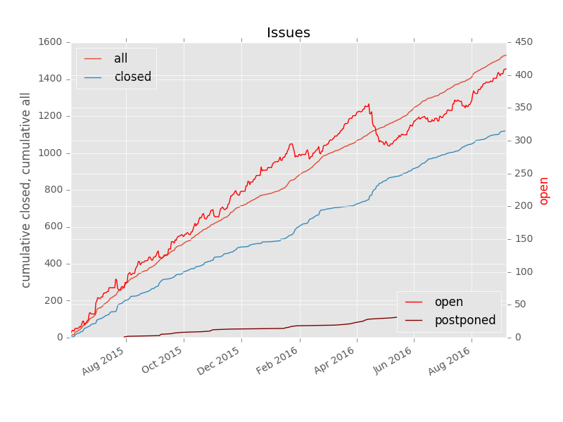
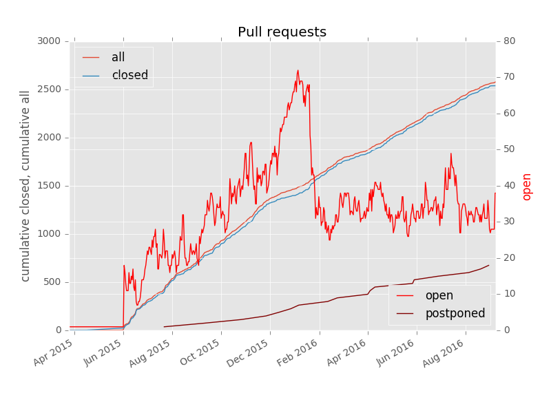

# github-state
A script to pull the list of issues from github and generate plots with statistics

### Example invocation
```
python3 github_state.py --project=systemd/systemd \
     --auth=user:hexadecimal-auth-token \
     --issues \
     --pull-requests
```

This will generate some plots in images/.                                           
The module can also be imported interactively.                                      




### License

This script is licensed under the GNU Lesser General Public License, version 2.1 or later, at your option.
